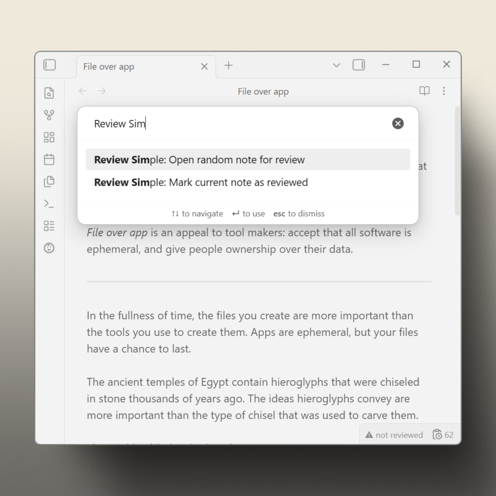

# Review Simple

Helps you reread and refine your notes on a recurring schedule. Last review date lives in each note's frontmatter.



## Features

- Per-note status bar indicator: `✓ 2025-11-04`, `⚠ due · 2025-09-10`, or `⚠ not reviewed`.
- Folder filter: **excluded** mode or **included**-only mode. Both lists preserved when switching.
- Intervals can be set at three levels: global default, per-folder rules, per-note frontmatter.
- Mark as reviewed via status bar click or command palette.
- Data stored in note frontmatter — no external database.
- Vault-wide counter of notes currently due for review.


<video src="https://github.com/user-attachments/assets/0aa6c179-e7a6-43a1-a914-7f7c487f79d9" controls></video>


## Quick start

1. Install with BRAT → `CitrusRenegade/review-simple-obsidian`.
2. Set folders to review and mode that fits your needs.
3. Choose a review interval (in days).
4. Reread to refine. Open a random due note via command palette, or by clicking the counter in the status bar.
5. Mark it reviewed the same way — command palette or click the per-note indicator.

Pending submission to the Community Plugins directory.

## Intervals

Resolution order:

1. `review_interval` in the note's frontmatter (number of days, or `never` to exclude).
2. Folder rule (longest matching path wins).
3. Global default.

Example per-note frontmatter:

```yaml
---
reviewed: 2025-10-15
review_interval: 14
---
```

## Commands

- `Open random note for review` — opens a random note that's currently due.
- `Mark current note as reviewed` — writes today's date to frontmatter.

Clicking the status bar items triggers the same actions.


## Configuration

Settings → Review Simple:

- Global review interval (days).
- Folder filter mode (excluded / included-only).
- Folder-specific intervals, one `folder/path,days` rule per line.
- Toggles to hide the per-note indicator or the due counter.
- Advanced: customize frontmatter keys (`reviewed`, `review_interval`).

## Alternatives

There are several Obsidian plugins and workflows for revisiting notes with their own trade-offs.

**[prncc/obsidian-repeat-plugin](https://github.com/prncc/obsidian-repeat-plugin)** - A close alternative for reviewing notes with frontmatter-driven schedules. Requires the Dataview plugin. Every note to be reviewed must have a `repeat` property. Bulk setup for existing notes is done through a separate `obsidian-scripts` workflow rather than through the plugin settings.

**[zachmueller/spaced-everything](https://github.com/zachmueller/spaced-everything)** - Implements a more opinionated workflow around spaced repetition for writing and incremental note development. Its "Onboard All Notes" feature performs a bulk frontmatter update, which may be less beginner-friendly in existing vaults. This is a broader onboarding model rather than a lightweight rule-based review workflow.

**[dartungar/obsidian-simple-note-review](https://github.com/dartungar/obsidian-simple-note-review)** - The closest conceptual alternative: it focuses on reviewing, resurfacing, and repeating ordinary notes. Requires the Dataview plugin. It uses note sets based on tags, folders, creation date, or DataviewJS queries, and keeps a persistent queue for each note set. Maintenance status: no recent release; latest GitHub release was on Apr 5, 2024.

**[Obsidian Spaced Repetition](https://github.com/st3v3nmw/obsidian-spaced-repetition)** - A mature spaced repetition plugin with a strong flashcards-first workflow. Whole-note review is supported, but the main workflow and documentation are centered around creating and reviewing flashcards.

**[ryanjamurphy/review-obsidian](https://github.com/ryanjamurphy/review-obsidian)** - Not a revisit notes workflow, just quick adds the current note to a future daily note by one, using the Natural Language Dates plugin to resolve the target date. Maintenance status: no recent release; latest GitHub release was on Dec 10, 2024.

<ins>**Powerful plugins + home-grown templates**</ins> - A similar workflow can be built with Dataview queries, custom query logic, and Templater commands for quickly marking notes as reviewed. This can be very flexible, but it also means maintaining a custom system instead of using a focused review workflow.

## Notes

- Status bar items are not visible on Obsidian mobile. Commands work everywhere.
- All data is stored in note frontmatter and created after first review.

*Inspired by the "Reviewed by ... on ..." field seen on WebMD. The "last reviewed" stamp shows up on other docs sites too — none come to mind by name.*
